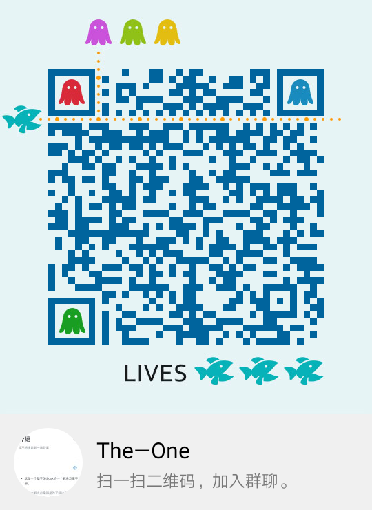

# 介绍

## 这是基于Gitbook的一个解决方案手册。

> 所谓一个解决方案就是为了解决在Google和百度上搜索半天，找到一堆不知对错答案的困扰。

* 其实就是一种新的呈现答案的方式。
* 比如说你想知道怎么养猫，它会告诉你如何如何。
* 它不会给你列出来一堆某某人如何如何回答（参见知乎），而是给你仅仅一种回答。
* 这个答案并不是一个人写的，而是所有人一起创作的，这就保证了答案理论上是最优的。
* **这个手册强调只有一个答案，而且每个答案都是最优解**，这就意味着：
  1. 它将是随时间更新的。
  2. 它将是众人可编辑的。
  3. 它将是易使用和易编辑的。
  4. **请不要写情绪方面的废话，注重解决问题。**
* 我选择GitBook和石墨文档来实现我所期望的功能。
* GitBook和石墨文档都是可协作的，也是可评论的。

## The-One是一个目录

* The-One并不是内容的主要储存网站
  * The-One将帮你指引到投稿人自己的网站（投稿人会被审核）
* The-One实际上是一个倡议，它倡议每个人贡献出一份答案并把它们合并成一份。
  * 这就意味着投稿人的网站需要满足以下要求（见下标题）

## 我是目录的管理者而不是内容的创作者

* The-One欢迎任何人来投稿但必须符合要求：
  1. 内容可被众人编辑且易编辑
  2. 版本回退
  3. 推荐gitwiki、腾讯文档、office online等工具
  4. 如果你没有适合的文档，那么看看**石墨文档**吧（在下面）
* 我日常也会收录一些内容来充实The-One，但它真的需要众人一起来完成。

## 内容推荐储存在石墨文档中

* 由于一下几点原因：
  * 优雅
  * 远超GitHub的流畅度
  * 方便管理的编辑权限
  * 版本回退
* 我决定使用[石墨文档](https://shimo.im/welcome)作为储存我们绝大多数文档内容的容器

### \*\*\*\*[**这是石墨文档的例子**](https://shimo.im/docs/3JJvN8KOQJA0dtFC/)**\(点击查看）**

### [这是腾讯文档的例子](https://docs.qq.com/doc/DVGZhUUVwZXBKVVlk)**\(点击查看）**

\*\*\*\*

> ## **尝试**[**联系我QQ735083049**](http://wpa.qq.com/msgrd?v=3&uin=735083049&site=qq&menu=yes)\*\*\*\*

* 好像只能PC端跳转

## 加群与我交流

> 具体操作我之后会出详细的教程，目前我在丰富项目内容。

> 暂由liu个人制作 ❤ 
>
> Made by liu right-now ❤

