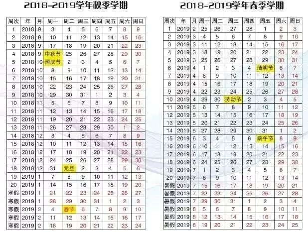

# 西北工业大学常见FAQ

## 校车时间点？/What time is the school bus?

* 长安校区
* 06:40 泰山路乘车点1辆
* 08:30 泰山路乘车点1辆 
* 09:00 泰山路乘车点1-2辆 
* 10:30 泰山路乘车点1-2辆 
* 11:00 泰山路乘车点1辆 
* 12:30 泰山路乘车点2-3辆 
* 13:00 泰山路乘车点1-2辆 
* 14:00 泰山路乘车点1-2辆 
* 15:00 泰山路乘车点2-3辆 
* 16:00 泰山路乘车点4-5辆 
* 17:10 泰山路乘车点6-7辆，东门外设有乘车点 
* 18:00 泰山路乘车点3-4辆 
* 19:00 泰山路乘车点1辆 
* 19:10 泰山路乘车点1辆 
* 21:00 泰山路乘车点2辆 
* 22:30 泰山路乘车点1辆

  **==周末及节假日==**

  08:00-09:00 泰山路乘车点6-7辆\(学生班车 发完为止\) 

* 09:00 泰山路乘车点2-3辆 
* 11:00 泰山路乘车点2-3辆 
* 12:30 泰山路乘车点2-3辆 
* 17:00 泰山路乘车点2-3辆 
* 18:00 泰山路乘车点2-3辆 
* 21:00 泰山路乘车点2辆

## 快递点位置/Express Point Location？

待定

## 如何计算学分积？/How to calculate credit integration?

点击访问[小瓜学分积助手 ](http://credit.nwpu.online/?nsukey=cmOIJAg1DtsiQzoOaukiDFVBWOLoUDNyHKTT1Jgwc0WBPeTfbPSn9TvJp1W4LWHcAO9sanJSpBXE1u4gqloo83qWoqRDJmN5xUR5z1tcPWSW2w%2BZRxXQiLk4id%2Bxq5puZpMaETyoK5yYuuJo0pqjog%3D%3D),即可查询学分积。

Click to visit the [Assistant](http://credit.nwpu.online/?nsukey=cmOIJAg1DtsiQzoOaukiDFVBWOLoUDNyHKTT1Jgwc0WBPeTfbPSn9TvJp1W4LWHcAO9sanJSpBXE1u4gqloo83qWoqRDJmN5xUR5z1tcPWSW2w%2BZRxXQiLk4id%2Bxq5puZpMaETyoK5yYuuJo0pqjog%3D%3D), you can query the Credit Accreditation.

## 校历？/School calendar？

